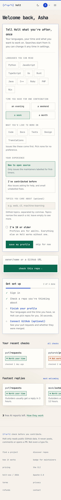
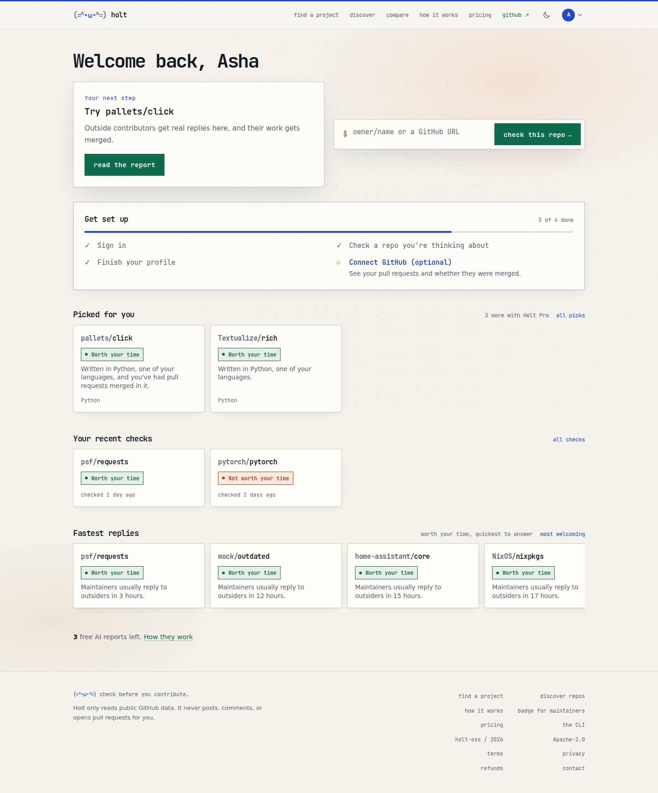

# The signed-in home

Status: **first version built** (PR #123), with the user's answers to the
open questions (end of this page). The prototype lives on the throwaway branch
`prototype-signed-in-home` (`/me?variant=A|B|C|D&state=new|returning` with
`MOCK_API=1`); it never merges.

Skills used: `marketing-skills:onboarding`, `marketing-skills:signup`,
`marketing-skills:cro`, `frontend-design:frontend-design`,
`pm-product-strategy:value-proposition`, `mattpocock-skills:prototype`.

## Today

- Every sign-in without a `callbackUrl` lands on `/`, the page that pitches
  Holt to strangers. The header's "sign in" link never sends one, so this is
  most sign-ins. Sign-ins from a report (AI report, playbook, pre-flight,
  pricing) already go back to it: `safeCallback` in `signin/page.tsx` and
  `api/dev-signin` handle that.
- `/me` is a 404. The signed-in pages are four separate places reached only
  from the avatar menu: `/for-you` (picks), `/me/history`,
  `/me/contributions`, and `/settings`, which is titled "Your AI reports" and
  holds credits, plan, profile and GitHub.
- Dead ends: a new account's `/for-you` is one empty box; the history empty
  state sends you back to `/`; `/connect` still says its features are "coming
  soon" (both have shipped); the profile card only appears on `/`, `/find`
  and `/hacktoberfest`.

| After sign-in (today) | `/me` (today) |
|---|---|
|  |  |

## What a signed-in person gets (value proposition)

A visitor can check any repo. Signing in adds four things, and the home page
should show all four: **what you've checked** (kept), **repos picked for
you** (from your languages, ranked by fixed rules), **your pull requests and
whether they landed** (GitHub connected), and **3 free AI reports**. The
job: *"I have one evening. Where should I spend it, and is my open PR going
anywhere?"* The first answer should appear on the first screen.

## Where sign-in lands

One rule, in one pure function (`afterSignIn(callbackUrl)`) used by the
sign-in page, the OAuth redirect and dev sign-in:

1. A safe `callbackUrl` other than `/` wins. Someone who signed in from a
   report goes back to that report, as today.
2. Anything else (none, `/`, or unsafe) goes to **`/me`**.
3. Signed-out visitors: unchanged. Signing out still goes to `/`.

**First sign-in asks for the profile.** `/me` opens the profile form at the
top (languages, time, what you'd like to work on, experience, topics) while
nothing is saved. It's optional: "skip for now" is one tap, is remembered
(the same `holt_profile_skip` cookie the other onboarding cards use) and never
blocks anything. After a skip, "Finish your profile" stays in the setup steps
and becomes the next-step card once a repo has been checked. When a
`callbackUrl` wins, the form waits for the next `/me` visit.

First-time and returning users land on the **same URL**. The page tells them
apart from what the account already has (a check, a profile, GitHub), not
from a "new user" flag we'd have to store. A day-one account sees the setup
steps; they go away as each is done. This is the onboarding skill's
"empty states are the onboarding" plus endowed progress: step 1, "Sign in",
is already ticked, so the list opens at 1 of 4.

## The home: `/me`

`/me` rather than a fifth URL: `/me/history` and `/me/contributions` already
live under it, and `me` is already excluded from repo routing in `proxy.ts`.
`/for-you` stays as the full list of picks.

Top to bottom (phone order; desktop puts 1 and 2 side by side):

1. **Welcome, Priya.** Then, while no profile is saved and it hasn't been
   skipped, **the profile form**, open. Otherwise **your next step**: one
   card, one button, chosen by fixed rules (`nextStep` in `lib/home.ts`): no
   check yet → check your first repo (the paste box itself); an open PR with
   no decision → "your pull request to X is still waiting", linking to that
   repo's report (reply times); no profile → finish your profile; else the
   top pick; else find a project.
2. **Check a repo**: the same paste box as `/`, always on the first screen.
3. **Get set up**, until every step is done: sign in (already ticked), check
   a repo, finish your profile, connect GitHub (optional).
4. **Themed rows**, each scrolling sideways. A row with nothing in it is
   hidden, not shown empty. They'll use the find page's new compact card
   once it's on main; until then a stand-in tile.
5. **AI reports**: "3 free AI reports left", with a link to claim the weekly
   one when it's due. Hidden when AI is switched off.

### Which rows, and what fills them

| Row | Filled by | Server work |
|---|---|---|
| Picked for you | `GET /v1/me/recommendations` (2 free, the rest need Pro) | none |
| Your recent checks | `GET /v1/me/history` | none |
| Your pull requests (waiting ones first) | `GET /v1/me/contributions` | none (connected users only) |
| Saved | the save-a-repo API another worker is building | that API |
| Welcoming <your language> repos | `GET /v1/discover?sort=welcoming&language=…`, one row per profile language (max 2) | none |
| Fastest replies | `/v1/discover?sort=welcoming&limit=100`, sorted by median reply time in `web/` | none for v1; a `sort=fastest` later sorts all repos, not just the top 100 |
| Trending on Holt | `GET /v1/discover?sort=trending` | none (often empty; hidden then) |
| Hacktoberfest | today only a find job (`POST /v1/find`, `hacktoberfest: true`): slow on a cold cache and spends GitHub points | a cached daily list, or `discover` with a Hacktoberfest filter |
| Quick wins for an evening | nothing yet: starter issues are per repo | a cross-repo issue feed, filtered by level and issue size |

Rows are ranked by fixed rules and say why a repo is there, the same as
`/for-you`. They never change a verdict.

### Day one vs returning

As built (`MOCK_API=1`; the mock gives every new account two checks, so it
says "Welcome back"):

| First sign-in (phone) | Returning, profile saved (desktop) |
|---|---|
|  |  |

The prototype:

| First visit (A, phone) | Returning, rows (D) |
|---|---|
|  |  |

More in `signed-in-home/`: B (two columns with a side rail), C (next step
first, three short lists), D on a phone. **Recommendation: C's next-step
card on top, D's rows below.** A lists everything with the same weight, so a
returning user scrolls past setup they've done. B's side rail becomes a
second page on a phone.

On day one the rows are mostly empty (no profile means no picks and no
language rows), so the first screen is the next step, the paste box and the
setup steps. Fastest replies and trending still fill, so there's
something to browse.

## `/` for a signed-in user, and the header

- `/` **redirects signed-in users to `/me`** with a 307 from `proxy.ts`, before
  any page renders (no flash of the landing page). It checks the session
  cookie against the `session` table; no cookie means no database lookup, and
  a stale cookie or a database error means "signed out". Signed-out visitors,
  crawlers and the OG image are unchanged.
- **`/?landing=1`** still shows the landing page to anyone. The avatar menu
  links to it as "about Holt".
- The header logo links to `/me` when signed in (to `/` when signed out); the
  avatar menu gets **home** as its first item. No new top-nav link.

## Built in the first version vs later

**Built (PR #123):** `afterSignIn` and the `/` redirect with tests
(`web/src/lib/home.test.ts`); `/me` with the first-visit profile form, the
next-step card, paste box, setup steps, and the six rows that need no server
work (picked for you, recent checks, your pull requests, welcoming repos in
your first two profile languages, fastest replies, trending), plus the credits
line; logo and menu edits. Rows use a stand-in tile
(`components/home/shelf.tsx`) until the find page's compact card is on main.

The Hacktoberfest row is built against PR #125's
`GET /v1/discover?hacktoberfest=true` and shows only when the response echoes
`hacktoberfest: true`, so it stays hidden until #125 is on main.

**Later:** Saved (after
save-a-repo merges), quick wins (server), the header "sign in" link returning
you to the page you were on, `/connect` copy, sign-in page copy that names
what you get, umami events for next-step clicks.

## Decisions (the user's answers, 28 Sep 2026)

1. `/` for a signed-in user: **redirect to `/me`**, server-side, with
   `/?landing=1` as the way back to the landing page.
2. `/me` is the home; `/for-you` stays the full list of picks.
3. Layout: next-step card on top, themed rows below.
4. Rows: the six that need no server work now; a slot for Hacktoberfest.
5. Connect GitHub stays the optional last setup step.
6. The header's "sign in" link returning you to the page you were on: later.
7. New: first sign-in asks for the profile, skippable in one tap.
