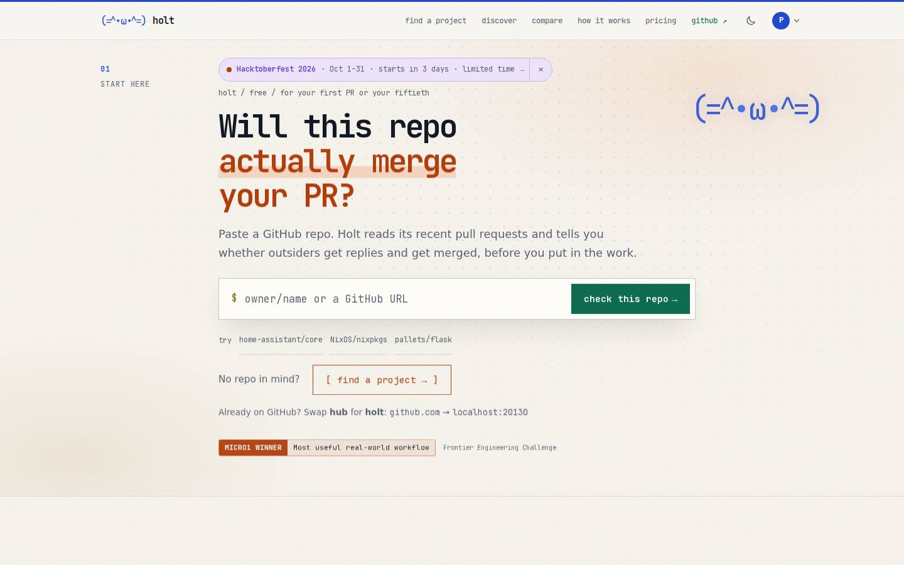
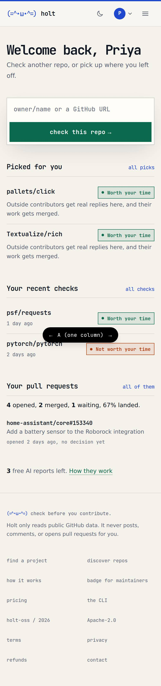
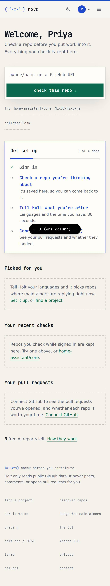
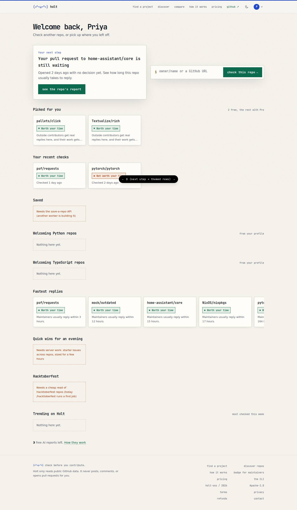

# The signed-in home

Status: **plan, waiting for answers** (the open questions at the end). Nothing
here is built yet. The prototype lives on the throwaway branch
`prototype-signed-in-home` (`/me?variant=A|B|C|D&state=new|returning` with
`MOCK_API=1`); it never merges.

Skills used: `marketing-skills:onboarding`, `marketing-skills:signup`,
`marketing-skills:cro`, `frontend-design:frontend-design`,
`pm-product-strategy:value-proposition`, `mattpocock-skills:prototype`.

## Today

- Every sign-in without a `callbackUrl` lands on `/`, the page that pitches
  Holt to strangers. The header's "sign in" link never sends one, so this is
  most sign-ins. Sign-ins from a report (AI report, playbook, pre-flight,
  pricing) already go back to it: `safeCallback` in `signin/page.tsx` and
  `api/dev-signin` handle that.
- `/me` is a 404. The signed-in pages are four separate places reached only
  from the avatar menu: `/for-you` (picks), `/me/history`,
  `/me/contributions`, and `/settings`, which is titled "Your AI reports" and
  holds credits, plan, profile and GitHub.
- Dead ends: a new account's `/for-you` is one empty box; the history empty
  state sends you back to `/`; `/connect` still says its features are "coming
  soon" (both have shipped); the profile card only appears on `/`, `/find`
  and `/hacktoberfest`.

| After sign-in (today) | `/me` (today) |
|---|---|
|  |  |

## What a signed-in person gets (value proposition)

A visitor can check any repo. Signing in adds four things, and the home page
should show all four: **what you've checked** (kept), **repos picked for
you** (from your languages, ranked by fixed rules), **your pull requests and
whether they landed** (GitHub connected), and **3 free AI reports**. The
job: *"I have one evening. Where should I spend it, and is my open PR going
anywhere?"* The first answer should appear on the first screen.

## Where sign-in lands

One rule, in one pure function (`afterSignIn(callbackUrl)`) used by the
sign-in page, the OAuth redirect and dev sign-in:

1. A safe `callbackUrl` other than `/` wins. Someone who signed in from a
   report goes back to that report, as today.
2. Anything else (none, `/`, or unsafe) goes to **`/me`**.
3. Signed-out visitors: unchanged. Signing out still goes to `/`.

First-time and returning users land on the **same URL**. The page tells them
apart from what the account already has (a check, a profile, GitHub), not
from a "new user" flag we'd have to store. A day-one account sees the setup
steps; they go away as each is done. This is the onboarding skill's
"empty states are the onboarding" plus endowed progress: step 1, "Sign in",
is already ticked, so the list opens at 1 of 4.

## The home: `/me`

`/me` rather than a fifth URL: `/me/history` and `/me/contributions` already
live under it, and `me` is already excluded from repo routing in `proxy.ts`.
`/for-you` stays as the full list of picks.

Top to bottom (phone order; desktop puts 1 and 2 side by side):

1. **Welcome, Priya** and one line. Then **your next step**: one card, one
   button, chosen by fixed rules: no check yet → check your first repo; an
   open PR with no decision → "your PR to X is still waiting", linking to that
   repo's report (reply times); no profile → tell Holt what you're after;
   else the top pick.
2. **Check a repo**: the same paste box as `/`, always on the first screen.
3. **Get set up** (day one only): check a repo, tell Holt what you're after
   (the existing profile form, 30 seconds), connect GitHub (optional).
4. **Themed rows**, each scrolling sideways, using the new compact repo card
   from the find-page redesign (odds bar, save button), not a card of its own.
   A row with nothing in it is hidden, not shown empty.
5. **AI reports**: "3 free AI reports left", and the weekly claim button when
   one is due. Hidden when AI is switched off.

### Which rows, and what fills them

| Row | Filled by | Server work |
|---|---|---|
| Picked for you | `GET /v1/me/recommendations` (2 free, the rest need Pro) | none |
| Your recent checks | `GET /v1/me/history` | none |
| Your pull requests (waiting ones first) | `GET /v1/me/contributions` | none (connected users only) |
| Saved | the save-a-repo API another worker is building | that API |
| Welcoming <your language> repos | `GET /v1/discover?sort=welcoming&language=…`, one row per profile language (max 2) | none |
| Fastest replies | `/v1/discover?sort=welcoming&limit=100`, sorted by median reply time in `web/` | none for v1; a `sort=fastest` later sorts all repos, not just the top 100 |
| Trending on Holt | `GET /v1/discover?sort=trending` | none (often empty; hidden then) |
| Hacktoberfest | today only a find job (`POST /v1/find`, `hacktoberfest: true`): slow on a cold cache and spends GitHub points | a cached daily list, or `discover` with a Hacktoberfest filter |
| Quick wins for an evening | nothing yet: starter issues are per repo | a cross-repo issue feed, filtered by level and issue size |

Rows are ranked by fixed rules and say why a repo is there, the same as
`/for-you`. They never change a verdict.

### Day one vs returning

| First visit (A, phone) | Returning, rows (D) |
|---|---|
|  |  |

More in `signed-in-home/`: B (two columns with a side rail), C (next step
first, three short lists), D on a phone. **Recommendation: C's next-step
card on top, D's rows below.** A lists everything with the same weight, so a
returning user scrolls past setup they've done. B's side rail becomes a
second page on a phone.

On day one the rows are mostly empty (no profile means no picks and no
language rows), so the first screen is the next step, the paste box and the
setup steps. Fastest replies and trending still fill, so there's
something to browse.

## `/` for a signed-in user, and the header

Keep `/` as the public landing page, with **no redirect**. Signed-in people
still reach it (logo on another tab, a shared link), and a redirect would
hide the pitch and the "swap hub for holt" trick from the team. Instead,
the home is where every signed-in path goes:

- the header logo links to `/me` when signed in (to `/` when signed out);
- the avatar menu gets **home** as its first item;
- history's empty state and `/connect`'s "not now" point at `/me`.

Header edits stay minimal (another worker owns `header.tsx` right now): an
`href` and one menu item. No new top-nav link.

## Tonight vs later

**Tonight (this PR, phase 2):** the `afterSignIn` rule and its tests; `/me`
with the next-step card, paste box, setup steps, and the rows that need no
server work (picks, recent checks, your PRs, welcoming in your languages,
fastest replies, trending), plus the credits line; logo and menu edits;
dead-end links pointed at `/me`. Rows use today's `PickCard`-style card
until the find-page card lands, then switch.

**Later:** Saved row (after save-a-repo merges), Hacktoberfest and quick-win
rows (server), a banner on `/` for signed-in users (page.tsx is owned by
another worker), `/connect` copy, sign-in page copy that names the four
things you get, a "hide setup" choice, umami events for next-step clicks.

## Open questions (with my recommendation)

1. **Should `/` redirect signed-in users to `/me`?** Recommend no: the logo
   and menu go to `/me` instead, and `/` stays one page for everyone.
2. **Is `/me` the right URL?** Recommend yes; `/for-you` stays the full pick list.
3. **Layout:** recommend next-step card on top plus themed rows (C + D).
4. **Which rows tonight?** Recommend the six that need no server work, with
   empty rows hidden. Hacktoberfest and quick wins wait for server work,
   and Hacktoberfest starts in 3 days, so that server row is worth a ticket now.
5. **Connect GitHub asks for 18+**, and many students are younger. Recommend
   keeping it as the optional last setup step, labelled optional.
6. **Should the header's plain "sign in" link send people back to the page
   they were on?** Recommend yes later, once the header work settles; for now
   they land on `/me`.
